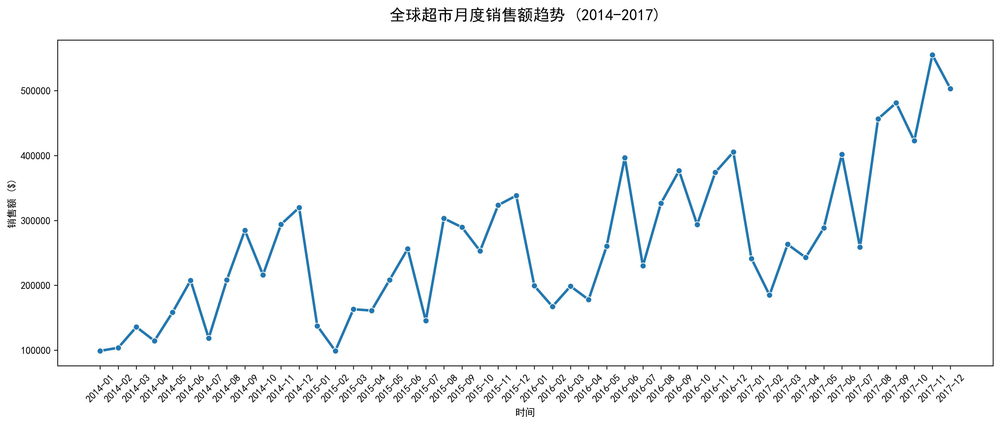

# Global Superstore Sales Analysis

**End-to-End Exploratory Data Analysis, RFM Customer Segmentation & Prophet Sales Forecasting**

这个项目对全球超市（Global Superstore）销售数据进行了全面分析，包括数据清洗、可视化探索、**RFM 客户分层**和高价值客户识别，以及使用 **Prophet** 模型对下季度销售额进行预测。

### 月度销售趋势


## 📊 核心业务洞察

- **月度销售趋势**：存在明显的季节性特征，年末通常出现销售高峰。
- **区域表现**：部分区域（如 Central / West）贡献了大部分销售额。
- **品类利润**：某些子类别（如 Tables / Bookcases）存在明显亏损，需要重点关注成本与定价。
- **退货率分析**：识别出退货率较高的品类，为退货政策优化提供数据支持。
- **RFM 客户分层**：高价值客户虽占比不高，但贡献了显著销售额。
- **销售额预测**：使用 Prophet 模型成功预测下一个季度的销售走势，并给出置信区间。

## 🛠️ 技术栈

- **Python**：Pandas, NumPy
- **可视化**：Matplotlib, Seaborn
- **时间序列预测**：Prophet (Facebook)
- **客户分析**：RFM 模型
- **开发工具**：PyCharm

## 📁 项目结构

```bash
global-superstore-sales-analysis/
├── superstore_analysis.py          # 主分析脚本（包含 EDA、RFM、Prophet）
├── requirements.txt                # 项目依赖包
├── .gitignore
├── README.md
└── output/                         # 生成的所有分析图表（6张高清 PNG）
    ├── 1_monthly_sales_trend.png
    ├── 2_region_sales.png
    ├── 3_return_rate_by_category.png
    ├── 4_rfm_segments.png
    ├── 5_prophet_sales_forecast.png
    └── 6_prophet_components.png


## 🚀 如何运行项目

1. 克隆仓库
   ```bash
   git clone https://github.com/240102541y-hkh/global-superstore-sales-analysis.git
   cd global-superstore-sales-analysis

2.安装依赖
pip install -r requirements.txt

3.下载数据集
从 Kaggle 下载 Global Superstore 数据集（Excel 格式）：
下载后将文件重命名为 Global Superstore Data.xlsx 并放到项目根目录

   

